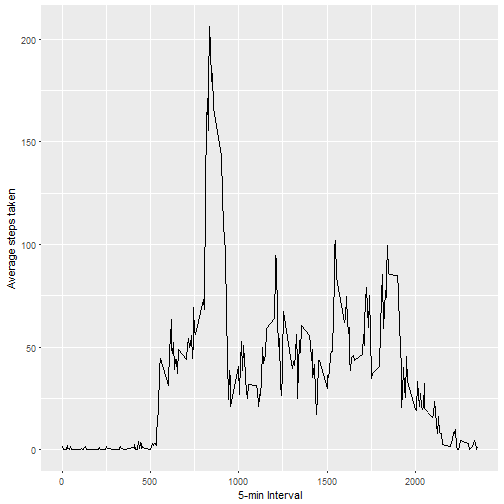

# JHU Reproducible Research:  Project 1


## Loading and preprocessing the data

```r
if(!file.exists('activity.csv')){
  unzip('activity.zip')
}
data <- read.csv('activity.csv')
```

## What is the mean total number of steps taken per day?


```r
total_steps <- tapply(data$steps,data$date,FUN=sum,na.rm=TRUE)
mean(total_steps,na.rm=TRUE)
```

```
## [1] 9354.23
```

```r
median(total_steps,na.rm=TRUE)
```

```
## [1] 10395
```

```r
qplot(total_steps,binwidth=1000,xlab="Total Steps per Day")
```


## What is the average daily activity pattern?

### Time series plot

```r
avg <- aggregate(x=list(steps=data$steps),by=list(interval=data$interval),FUN=mean,na.rm=TRUE)
ggplot(data=avg,aes(x=interval,y=steps))+
  geom_line()+
  xlab("5-min Interval")+
  ylab("Average steps taken")
```



### Which 5-min interval contains the maximum number of steps?


```r
Most_Steps <- which.max(avg$steps)
```

*The interval with the most steps is: 104

## Imputing missing values

### Some days and intervals having missing values denoted as NA.  Missing data may introduce bias into some of the calculations.

### Fist we will report the total number of missinf values in the dataset


```r
MissingValues <- is.na(data$steps)
table(MissingValues)
```

```
## MissingValues
## FALSE  TRUE 
## 15264  2304
```

### One strategy is to replace missing values with the mean values of the corresponding 5-min interval.  The impute function in the Hmisc package can be used for this purpose.


```r
ImputedData <- data
ImputedData$steps <- impute(data$steps,fun=mean)
```

### A histogram can be created to plot the total number of steps taken each day

```r
ImputedStepsPerDay <- tapply(ImputedData$steps,ImputedData$date,sum)
qplot(ImputedStepsPerDay,xlab='Total Steps per Day',ylab='Frequency of Steps',binwidth=500)
```


### The mean and median total steps per day can be calculated

```r
ImputedStepsPerDay_Mean <- mean(ImputedStepsPerDay)
ImputedStepsPerDay_Median <- median(ImputedStepsPerDay)
```
*Mean: 1.0766189 &times; 10<sup>4</sup>
*Median: 1.0766189 &times; 10<sup>4</sup>

## Are there differences in activity patterns between weekdays and weekends?
### First, we will make a short function to determine if a particular day is a weekday or weekend day


```r
TypeOfDay <- function(date){
  day <- weekdays(date)
  if (day %in% c("Monday","Tuesday","Wednesday","Thursday","Friday"))
    return("weekday")
  else if (day %in% c("Saturday","Sunday"))
    return("weekend")
  else
    stop("not a valid date")
}

ImputedData$date <- as.Date(ImputedData$date)
ImputedData$day <- sapply(ImputedData$date,FUN=TypeOfDay)
```

### Now a plot can be created looking at the average number of steps taken on weekdays and weekends

```r
avg2 <- aggregate(steps~interval+day,data=ImputedData,mean)
ggplot(avg2,aes(interval,steps))+
  geom_line()+
  facet_grid(day~.)+
  xlab("5-min interval")+
  ylab("Number of Steps")
```


